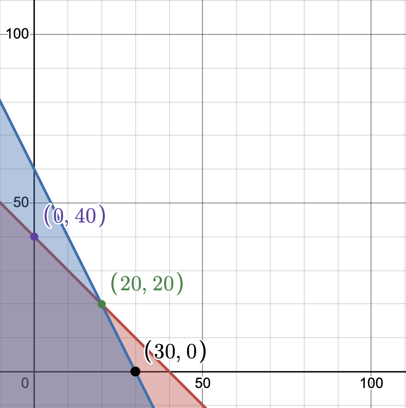

# Deep Q-Learning for Linear Optimization

## Overview
This project demonstrates the application of a **Deep Q-Learning (DQN)** agent to solve a constrained linear optimization problem.  
The implementation is provided in the Jupyter notebook [`two_var_solved.ipynb`](./two_var_solved.ipynb) using Python.  

The DQN agent learns to **maximize an objective function while adhering to constraints**, leveraging reinforcement learning techniques. The notebook includes code for:

- Custom environment  
- DQN model and replay buffer  
- Training loop  
- Visualization of results  

The optimization problem solved is illustrated below:

<p align="center">
  
</p>

---

## Problem Description

We want to maximize the objective:

```math
z = 4x + 3y
``` 
subject to the following constraints:

```math
x + y <= 40
2x + y <= 60
x, y >= 0
```


## Setup

### 1. Clone the Repository:

```
git clone https://github.com/23f3002157/Optimization_RL.git
cd Two_Variables
```


### 2. Install Dependencies: 
Ensure Python 3.12.8 or later is installed, then run:

```
pip install -r requirements.txt
```


### 3. Hardware Requirements:

```
The code is configured to use the MPS backend (torch.device("mps")) for Apple Silicon GPUs. For non-MPS systems, modify the device to "cpu" in the notebook (Cell 2). 
A standard CPU is sufficient for running the notebook, though training may be slower.
```

### 4. Usage

```
1. Open the Notebook: Launch Jupyter Notebook or JupyterLab and open two_var_solved.ipynb:

2. jupyter notebook two_var_solved.ipynb

3. Run the Cells:

    3.1 Execute all cells sequentially to:
    3.2 Load libraries and set random seeds (Cells 1-4).
    3.3 Define the DQN model and replay buffer (Cells 5-6).
    3.4 Define the optimization problem and environment (Cells 7-8).
    3.5 Initialize the environment.
    3.6 Set up the DQN model and optimizer (Cell 10).
    3.7 Train the DQN agent (Cell 11).
    3.8Visualize training metrics and final states (Cells 12-14).

4. Training:

    Run Cell 11 to train the DQN agent for 2000 episodes. Training logs will print every 100 episodes, showing average reward, epsilon, final state, average objective, and average constraint violation.

5. Visualization:
    Cell 12 plots smoothed rewards vs. episodes. Cell 13 plots average constraint violations and objective values vs. episodes. Cell 14 plots the feasible region, constraints, and final states, with the problem depicted in images/two_v.jpeg.

6. Results

    The DQN agent learns to converge to the optimal point (20, 20), achieving an objective value 140. 

7. Notes

    Hyperparameters: Tuned for stability (e.g., LR=5e-4, EPSILON_DECAY=20000, PENALTY=100.0). Adjust in Cell 3 or 11 if needed.

```
### 5. Author

Risshab Srinivas Ramesh
